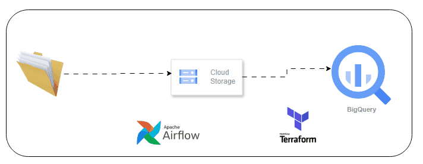
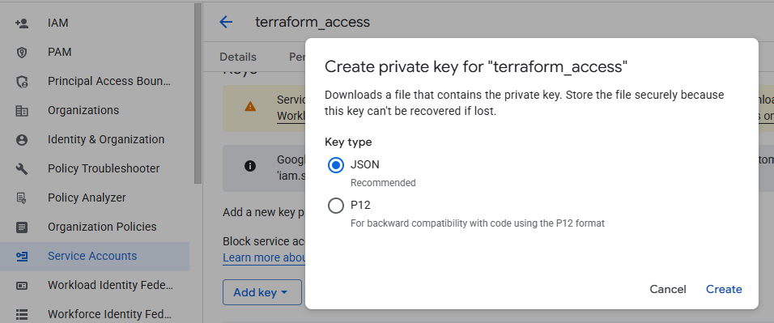

## Apache Airflow - GCS - BQ - Terraform

### About
A data pipeline that automates the movement of data from local file system to Google cloud storage and BigQuery.

## Pipeline Architecture


### Prerequisites
- Python 3.10 or higher
- Git
- Terraform
- Docker
- Google Cloud Service ( Cloud Storage, BigQuery )
- Apache Airflow via [Astro CLI](https://docs.astronomer.io/astro/cli/install-cli)


### How to run
#### Clone the Repository

```bash
# Clone the repository
git clone https://github.com/ioaviator/airflow_gcs_bq_terraform.git

# Navigate to project directory
cd airflow_gcs_bq_terraform
```

### Provision GCP resource (Cloud Storage, BigQuery) with Terraform

#### Download Google cloud SDK and login from the command line 

```bash 
  gcloud auth application-default login 
```

```bash
# Navigate to terraform directory
cd terraform
```

Login to [Cloud Console](https://console.cloud.google.com/)  
Manually create a project and cloud storage bucket, which will be used to store terraform state file remotely

```bash
## terraform/backend.tf

  terraform {
    backend "gcs" {
      bucket = "your-bucket-name"
      prefix  = "terraform/state"
      project = "your-gcp-project-id"
    }
  }
```

Run the following commands
- Initialize: `terraform init`
- Plan: `terraform plan -out main.tfplan`
- Apply: `terraform apply --auto-approve main.tfplan`

###  Create service account key


Save the secret json file inside `dags/gcs_bq/` directory.


### Start Project

```bash
# Navigate back to root directory
cd ..
```

```bash
# start project
astro dev start
```

```bash
# stop project
astro dev stop
```
